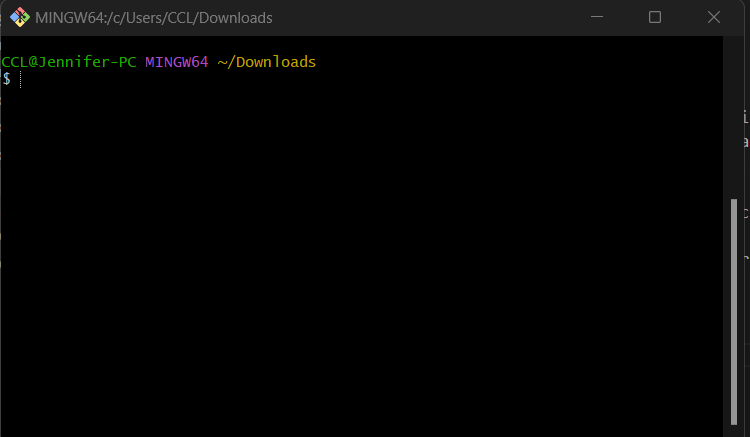
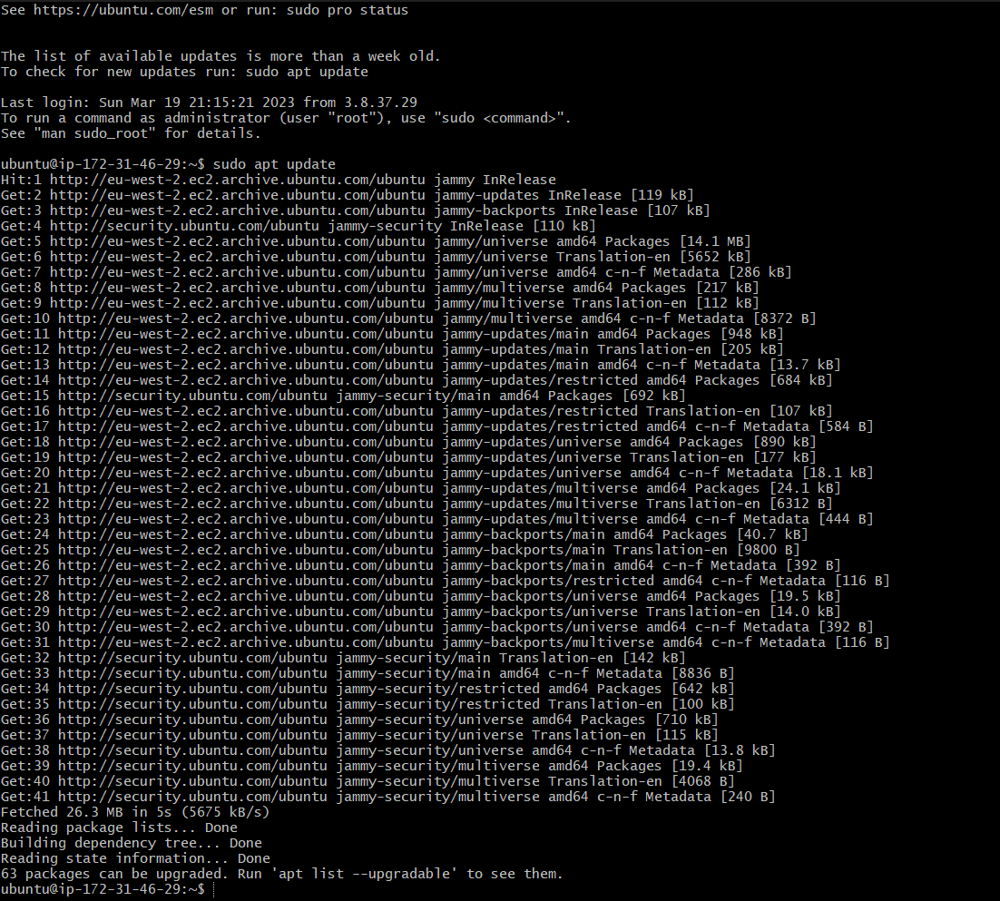
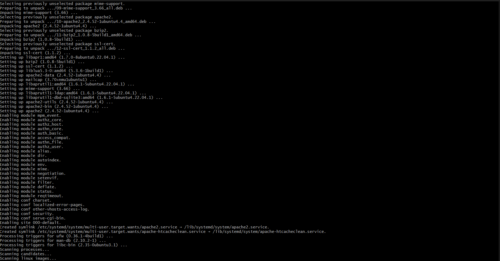
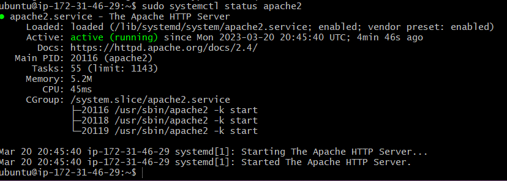
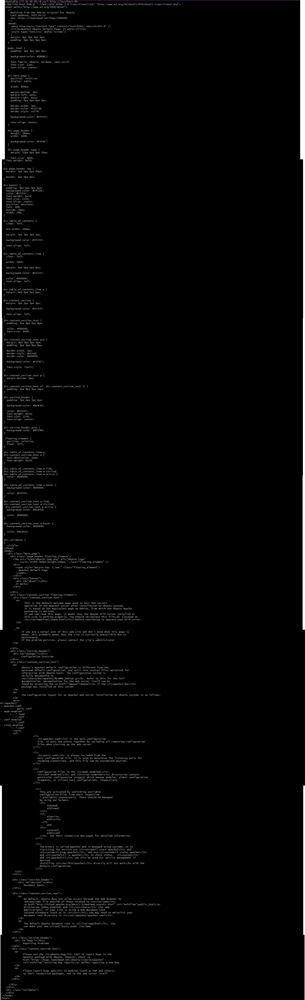
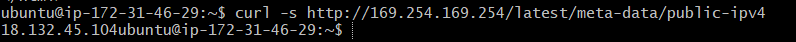

# LAMP STACK IMPLEMENTATION DOCUMENTATION FOR PROJECT ONE

### First we set up a LAMP STACK using EC2
### create an account on AWS.
1. Start by creating an instance (virtual machine) by selecting “ubuntu server 20.04 LTS” from Amazon Machine Image(AMI)(free tier).
2. Then select “t2.micro”
then go to the security group and select “a security group” review and launch instance.
3. Ten open a terminal on your system and ebter the folder where your previously download PEM file is located.

### In this case we use the Git Bash Terminal

### 
4. Connect to the instance from ubuntu terminal using thIS command:

> `ssh -i "Jennee-EC2.pem" ubuntu@ec2-18-132-45-104.eu-west-2.compute.amazonaws.com`

[^1]: Use your own exact Public DNS, not the exct command above.
---
---
## STEP 1 — INSTALLING APACHE AND UPDATING THE FIREWALL

## Installing Apache using Ubuntu’s package manager ‘apt’:

> `sudo apt update`

> `sudo apt install apache2`

## To verify that apache2 is running as a Service in the OS, following command is used

`sudo systemctl status apache2`

## Opening the default port that web browsers use to access web pages on the Internet, which TCP port 80

> `curl http://localhost:80`

## Then check how to access it locally in Ubuntu shell

> `curl -s http://169.254.169.254/latest/meta-data/public-ipv4`

## STEP 2 — INSTALLING MYSQL

##  Installing a Database Management System (DBMS) to be able to store and manage data for the site in a relational database.

## Using ‘apt’ again to acquire and install this software:

> `$ sudo apt install mysql-server`