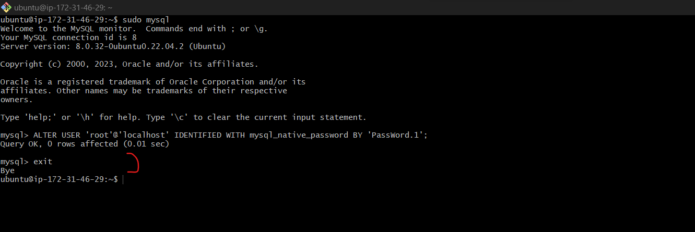

# LAMP STACK IMPLEMENTATION DOCUMENTATION FOR PROJECT ONE

### First we set up a LAMP STACK using EC2
### create an account on AWS.
1. Start by creating an instance (virtual machine) by selecting “ubuntu server 20.04 LTS” from Amazon Machine Image(AMI)(free tier).
2. Then select “t2.micro”
then go to the security group and select “a security group” review and launch instance.
3. Then open a terminal on your system and enter the folder where your previously download PEM file is located.

### In this case we use the Git Bash Terminal

### 
4. Connect to the instance from ubuntu terminal using thIS command:

> `ssh -i "Jennee-EC2.pem" ubuntu@ec2-13-41-53-207.eu-west-2.compute.amazonaws.com`

[^1]: Use your own exact Public DNS, not the exct command above.

### This automatically connects to the instance when you click Enter

---
---
## STEP 1 — INSTALLING APACHE AND UPDATING THE FIREWALL

## Installing Apache using Ubuntu’s package manager ‘apt’:

> `sudo apt update`

### Then we install the web server(Apache HTTP server) by running this command:

> `sudo apt install apache2`

### To verify that apache2 is running as a Service in the OS, following command is used

`sudo systemctl status apache2`

### Opening the default port that web browsers use to access web pages on the Internet, which TCP port 80

> `curl http://localhost:80`

### Then check how to access it locally in Ubuntu shell

> `curl -s http://169.254.169.254/latest/meta-data/public-ipv4`

## STEP 2 — INSTALLING MYSQL

##  Installing a Database Management System (DBMS) to be able to store and manage data for the site in a relational database.

### Using ‘apt’ again to install MySQL server:

> `$ sudo apt install mysql-server`

### Then we log into the sql server using this command:

> `$ sudo mysql`

### This will connect to the MySQL server as the administrative database user root

### Set password as "PassWord.1" for root user, using this command:

> `mysql> ALTER USER 'root'@'localhost' IDENTIFIED WITH mysql_native_password BY 'PassWord.1';`

### Then exit the MySQL shell with this command:

>` mysql> exit`

### The run this command to start the interactive script:
>` sudo mysql_secure_installation`
### Set up a secure password and follow the prompts

### Then test if you’re able to log in to the MySQL console using this command:
> `sudo mysql -p`

### Then exit with thi command:
>` mysql> exit`

---
---
## STEP 3 - SETTING UP PHP

### Install PHP by running this command:
>`sudo apt install php libapache2-mod-php php-mysql`

### Then run the following command to confirm your PHP version:
>`php -v`

---
---
## STEP 4 - CREATING A VIRTUAL HOST FOR YOUR WEBSITE USING APACHE

### Create the directory for projectlamp using ‘mkdir’ command:
>`sudo mkdir /var/www/projectlamp`
### Then, assign ownership of the directory with your current system user using this command:
>`sudo chown -R $USER:$USER /var/www/projectlamp`

### Then, create and open a new configuration file in Apache’s directory using this command:

>`sudo vi /etc/apache2/sites-available/projectlamp.conf`

### Hit "i" on the keyboard to enter the Insert mode, the paste the fowwing text:

`<VirtualHost *:80>
    ServerName projectlamp
    ServerAlias www.projectlamp 
    ServerAdmin webmaster@localhost
    DocumentRoot /var/www/projectlamp
    ErrorLog ${APACHE_LOG_DIR}/error.log
    CustomLog ${APACHE_LOG_DIR}/access.log combined
</VirtualHost>`

### Exit the Insert mode by clicking the esc button then type 
`:wq` and press Enter.

### Enable the new virtual host using this command:
>`sudo a2ensite projectlamp`

### Then disable the default website that comes installed with Apache with this command:
>`sudo a2dissite 000-default`

### Next, make sure your configuration file doesn’t contain syntax errors, using this command:
>`sudo apache2ctl configtest`

### Then, finally, reload Apache so these changes take effect, using this command:
>`sudo systemctl reload apache2`

### Next is to Create an index.html file in that location. Use this command:

### Test that the virtual host works as expected, by pasting this on the browser:
>`http://<Public-IP-Address>:80`

---
---
## STEP 5 - ENABLE PHP ON THE WEBSITE

### Edit the following file to enable PHP on the website
>`sudo vim /etc/apache2/mods-enabled/dir.conf`

### Exit the edit mode by clicking the esc button then type 
`:wq` and press Enter.

### Reload Apache for the changes to take effect, using this ccommand:
>`sudo systemctl reload apache2`

### Finally, create a PHP script to test that PHP is correctly installed and configured on the server.

### Create a new file named index.php inside your custom web root folder:
>`vim /var/www/projectlamp/index.php`
### And add this PHP script in it:
>`<?php
phpinfo();`

### Save and reload Apache then go to browser and reload the 'Public IP Address' page:
 

### Then remove the index.php file created in projectlamp using this command:
>`sudo rm /var/www/projectlamp/index.php`

